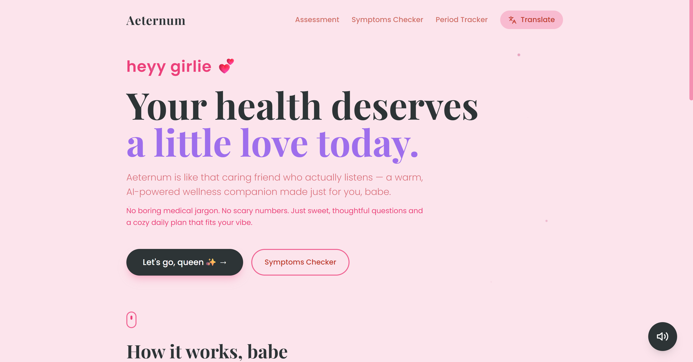
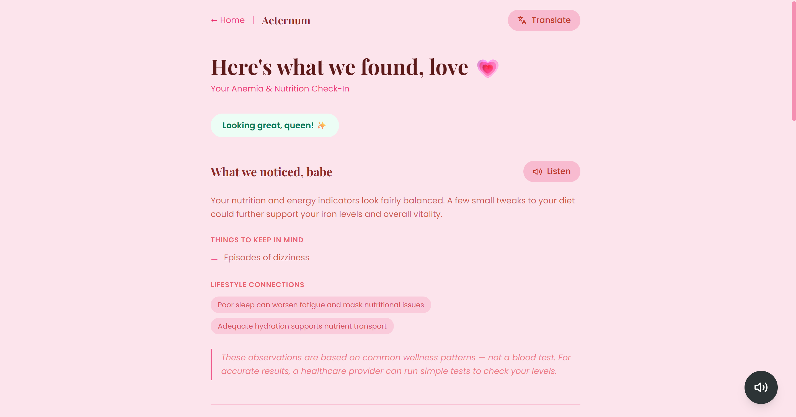
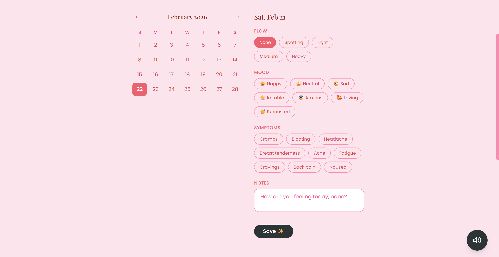
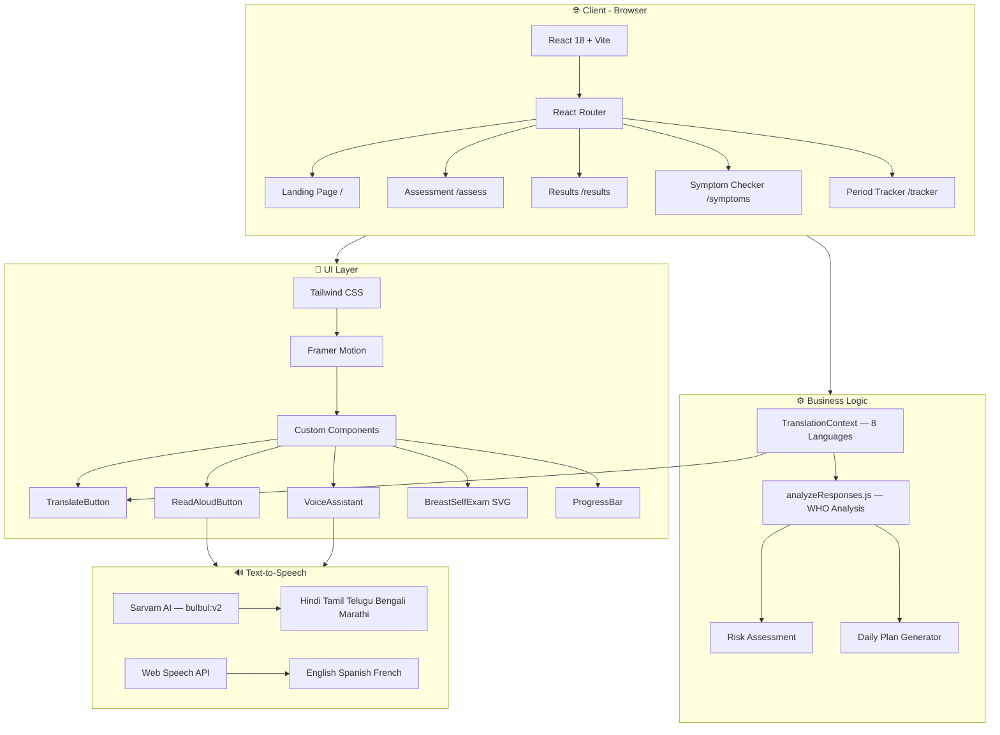
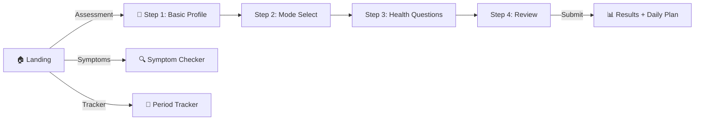

<div align="center">

# 💗 Aeternum — Your AI Wellness Companion

**A warm, AI-powered health & wellness platform designed for women**

*No boring medical jargon. No scary numbers. Just sweet, thoughtful questions and a cozy daily plan that fits your vibe.*

[](https://aeternum1.vercel.app/)
[](LICENSE)
[](https://react.dev)
[](https://vitejs.dev)

</div>

---

## 📖 Project Description

**Aeternum** is a minimalist, woman-focused wellness web application that helps users understand their health through gentle, conversational assessments. It covers **period & hormonal health**, **anemia & nutrition**, and **cancer awareness** — using WHO-inspired frameworks to generate personalized daily wellness plans.

The app is designed with accessibility at its core: a **multilingual voice assistant** reads every page aloud in **8 languages** (including Hindi, Tamil, Telugu, Bengali, Marathi) using **Sarvam AI's regional TTS engine**, making it usable even by people with limited literacy.

---

## 🛠️ Tech Stack

| Layer | Technology | Purpose |
|-------|-----------|---------|
| **Frontend** | React 18 | Component-based UI |
| **Build Tool** | Vite 5.4 | Fast dev server & bundling |
| **Styling** | Tailwind CSS 3.4 | Utility-first CSS framework |
| **Animations** | Framer Motion | Smooth page transitions & micro-interactions |
| **Routing** | React Router v6 | SPA navigation |
| **Fonts** | Playfair Display + Poppins | Elegant serif headings + clean body text |
| **TTS (Regional)** | Sarvam AI (bulbul:v2) | Hindi, Tamil, Telugu, Bengali, Marathi voice |
| **TTS (Global)** | Web Speech API | English, Spanish, French voice |
| **i18n** | React Context | Full-page translation in 8 languages |
| **Analysis** | Custom JS Engine | WHO-inspired health pattern analysis |

---

## ✨ Features

### Core Features
1. **🩺 AI Health Assessment** — 4-step guided questionnaire (Basic Profile → Mode Selection → Detailed Questions → Review) with auto-calculated BMI, slider inputs, and animated transitions
2. **📊 Personalized Results** — Risk level badge (low/moderate/high/screening), detailed health report, lifestyle connections, and a full morning-to-night daily wellness plan
3. **🔍 Symptom Checker** — Interactive symptom selection interface covering 20+ common symptoms with instant AI-powered analysis and care suggestions
4. **📅 Period Tracker** — Calendar-based period logging with cycle length tracking, next period prediction, fertile window estimation, and flow/mood/symptom logging
5. **🔊 Multilingual Voice Assistant** — Floating accessibility button on every page that reads the entire page aloud — uses Sarvam AI for regional Indian languages
6. **🌐 Full-Page Translation** — Translate the entire UI into 8 languages (English, Hindi, Tamil, Telugu, Bengali, Marathi, Spanish, French) with one click
7. **🎀 Cancer Awareness Module** — Interactive breast self-exam SVG guide with step-by-step instructions + cervical health awareness with screening reminders
8. **🎧 Read Aloud on Every Section** — Individual read-aloud buttons throughout the app for features, results, and daily plans

### Design
- Soft blush-pink gradient aesthetic inspired by feminine wellness
- Playfair Display serif headings with Poppins body text
- Sparkle animations on the hero section
- Smooth page slide transitions via Framer Motion
- Fully responsive (mobile-first)
- No card/box containers — flowing, breathable, human layout

---

## 📸 Screenshots

> **Add your screenshots to `docs/screenshots/` and they will display below.**

| Landing Page | Assessment | Results |
|:---:|:---:|:---:|
|  |  |  |

| Symptom Checker | Period Tracker | Voice Assistant |
|:---:|:---:|:---:|
|  |  |  |

> **To capture screenshots:** Run the app (`npm run dev`), open `http://localhost:5173`, and take screenshots of each page. Save them in `docs/screenshots/` with the filenames above.

---

## 🎬 Demo Video

> **[📹 Watch Demo Video](#)** *https://docs.google.com/document/d/1K--U7WIShXVK9yw0nsZgEzNWok19qX7fDoxYx_OniJg/edit?usp=sharing*

The demo should show:
- Landing page with sparkle animations
- Full assessment flow (4 steps)
- Results page with daily plan
- Symptom checker in action
- Period tracker logging
- Voice assistant reading a page in Hindi
- Language switching

---

## 🏗️ Architecture Diagram



> Full architecture docs: [`docs/architecture.md`](docs/architecture.md)

---

## 🗺️ App Flow Diagram



> Full flow docs: [`docs/app-flow.md`](docs/app-flow.md)

---

## 🚀 Installation

### Prerequisites
- **Node.js** ≥ 18.x
- **npm** ≥ 9.x

### Setup

```bash
# Clone the repository
git clone https://github.com/aradhana225746-a11y/aeternum1.git
cd aeternum1/saheli-ai

# Install dependencies
npm install
```

### Environment Variables

Create a `.env` file in the project root:

```env
VITE_SARVAM_API_KEY=your_sarvam_api_key_here
```

> Get a free API key from [Sarvam AI](https://www.sarvam.ai/) for regional language TTS. The app works without it (falls back to browser TTS).

---

## ▶️ Run Commands

```bash
# Start development server
npm run dev
# → Opens at http://localhost:5173

# Build for production
npm run build
# → Output in dist/

# Preview production build
npm run preview
```

---

## 📁 Folder Structure

```
aeternum1/
├── README.md                  # This file
├── LICENSE                    # MIT License
├── .gitignore                 # Git ignore rules
├── docs/                      # Documentation & diagrams
│   ├── architecture.md        # Architecture diagram & explanation
│   ├── app-flow.md            # App flow diagram & screen guide
│   └── screenshots/           # App screenshots
├── saheli-ai/                 # Main application
│   ├── package.json           # Dependencies & scripts
│   ├── vite.config.js         # Vite configuration
│   ├── tailwind.config.js     # Tailwind CSS configuration
│   ├── postcss.config.js      # PostCSS configuration
│   ├── index.html             # HTML entry point
│   ├── public/                # Static assets
│   └── src/                   # Source code
│       ├── main.jsx           # React entry point
│       ├── App.jsx            # Router + providers
│       ├── index.css          # Global styles
│       ├── api/
│       │   └── sarvamTTS.js   # Sarvam AI TTS integration
│       ├── analysis/
│       │   └── analyzeResponses.js  # WHO-based health analysis engine
│       ├── context/
│       │   └── TranslationContext.jsx  # i18n (8 languages)
│       ├── components/
│       │   ├── VoiceAssistant.jsx     # Floating voice assistant
│       │   ├── ReadAloudButton.jsx    # Section read-aloud
│       │   ├── TranslateButton.jsx    # Language switcher
│       │   ├── ProgressBar.jsx        # Assessment progress
│       │   ├── GlowCard.jsx           # Section wrapper
│       │   ├── BreastSelfExam.jsx     # Interactive SVG guide
│       │   ├── CervicalHealth.jsx     # Cervical health info
│       │   └── NoiseOverlay.jsx       # Visual texture
│       └── pages/
│           ├── LandingPage.jsx        # Home page
│           ├── AssessmentPage.jsx     # 4-step assessment
│           ├── ResultsPage.jsx        # Results + daily plan
│           ├── SymptomCheckerPage.jsx # Symptom checker
│           └── PeriodTrackerPage.jsx  # Period tracker
```

---

## 🔌 API Documentation

### Sarvam AI TTS (External API)

The app integrates with **Sarvam AI's Text-to-Speech API** for regional Indian language audio.

| Endpoint | Method | Description |
|----------|--------|-------------|
| `https://api.sarvam.ai/text-to-speech` | POST | Convert text to speech audio |

**Request Body:**
```json
{
  "inputs": ["Text to convert"],
  "target_language_code": "hi-IN",
  "speaker": "meera",
  "model": "bulbul:v2",
  "pitch": 0,
  "pace": 1.0,
  "loudness": 1.5,
  "enable_preprocessing": true
}
```

**Supported Languages:**
| Code | Language |
|------|----------|
| `hi-IN` | Hindi |
| `ta-IN` | Tamil |
| `te-IN` | Telugu |
| `bn-IN` | Bengali |
| `mr-IN` | Marathi |
| `en-IN` | English (Indian) |

**Response:** Returns base64-encoded WAV audio chunks.

### Internal Analysis Engine

`analyzeResponses.js` processes assessment data client-side:

```
Input: { age, weight, height, sleepQuality, stressLevel, mode, ... }
    ↓
WHO-inspired scoring algorithms
    ↓
Output: { risk: 'low'|'moderate'|'high', report: {...}, dailyPlan: {...} }
```

---

## 👥 Team Members

| Name | Role | GitHub |
|------|------|--------|
| Aradhana Rose | Developer | [@aradhana225746-a11y](https://github.com/aradhana225746-a11y) |
| Christina Joseph | Developer | — |

---

## 🤖 AI Tools Used

| Tool | Usage |
|------|-------|
| **GitHub Copilot (Claude)** | Code generation, component creation, debugging, architecture design |
| **Sarvam AI** | Regional language text-to-speech (bulbul:v2 model, meera speaker) |

> AI was used as a development assistant. All code was reviewed, tested, and refined by the team.

---

## 🌐 Deployment

- **Live URL:** [https://aeternum1.vercel.app](https://aeternum1.vercel.app)
- **Platform:** Vercel
- **HTTPS:** ✅ Enabled
- **Build Command:** `cd saheli-ai && npm run build`
- **Output Directory:** `saheli-ai/dist`

---

## 📄 License

This project is licensed under the **MIT License** — see the [LICENSE](LICENSE) file for details.

---

<div align="center">

**Made with 💗 by Aradhana Rose & Christina Joseph**

*Not a medical device. For guidance only.*

</div>
