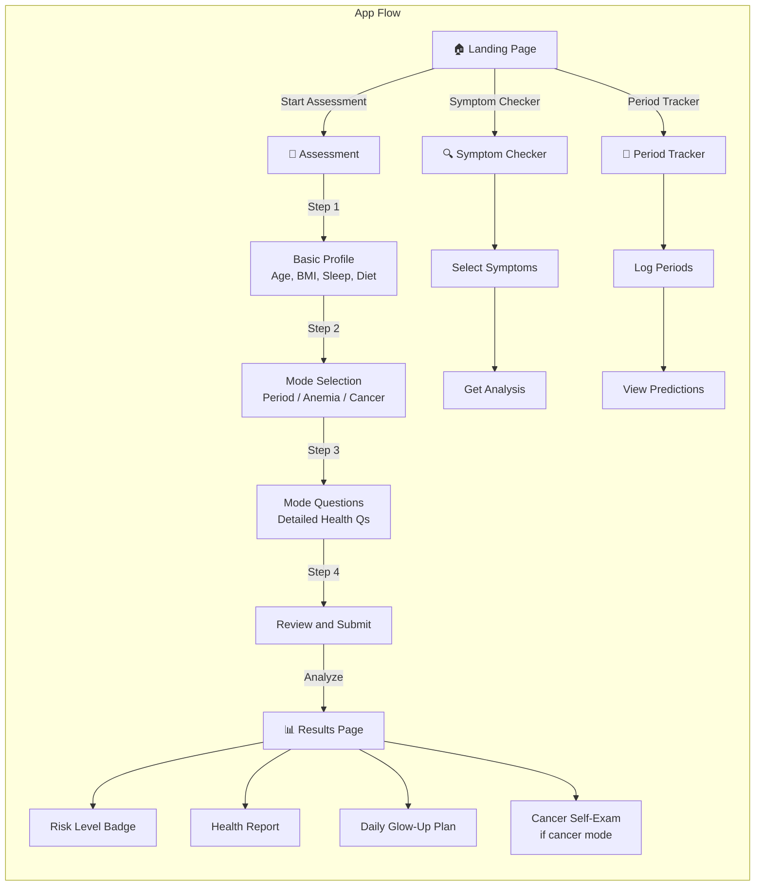

# App Flow Diagram

## Screen Navigation

| Screen | Route | Description |
|--------|-------|-------------|
| Landing Page | `/` | Hero, features, navigation to all tools |
| Assessment | `/assess` | 4-step health questionnaire |
| Results | `/results` | Risk report + personalized daily plan |
| Symptom Checker | `/symptoms` | Interactive symptom selection + analysis |
| Period Tracker | `/tracker` | Calendar-based period logging + predictions |

## Assessment Flow (4 Steps)

1. **Basic Profile** — Age, height, weight, BMI (auto-calculated), sleep, stress, activity, diet, water intake
2. **Mode Selection** — Choose focus: Period & Hormones, Anemia & Nutrition, or Cancer Awareness
3. **Mode Questions** — Detailed questions specific to the chosen mode (15-20 questions)
4. **Review & Submit** — Review all answers, then submit for analysis
