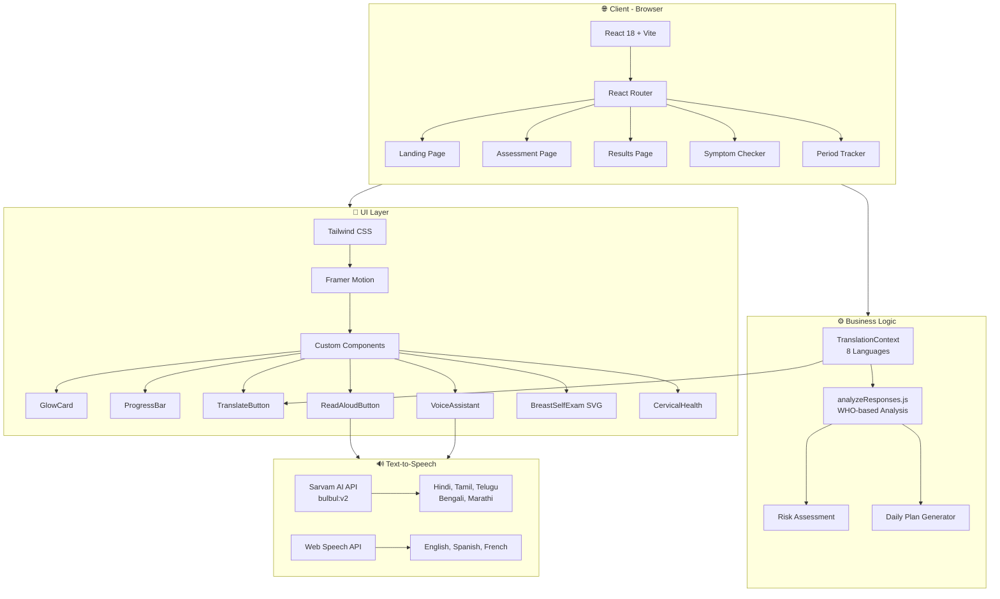

# Architecture Diagram

## Overview

Aeternum is a fully client-side React SPA. There is no backend server — all analysis runs in the browser using `analyzeResponses.js`. The only external API call is to **Sarvam AI** for regional language text-to-speech.

### Layers

| Layer | Technology | Purpose |
|-------|-----------|---------|
| **Routing** | React Router v6 | SPA navigation between 5 pages |
| **UI** | Tailwind CSS + Framer Motion | Styling, animations, transitions |
| **State** | React Context | Translation state (language selection) |
| **Analysis** | analyzeResponses.js | WHO-inspired risk scoring + plan generation |
| **TTS** | Sarvam AI + Web Speech API | Multilingual read-aloud for accessibility |
